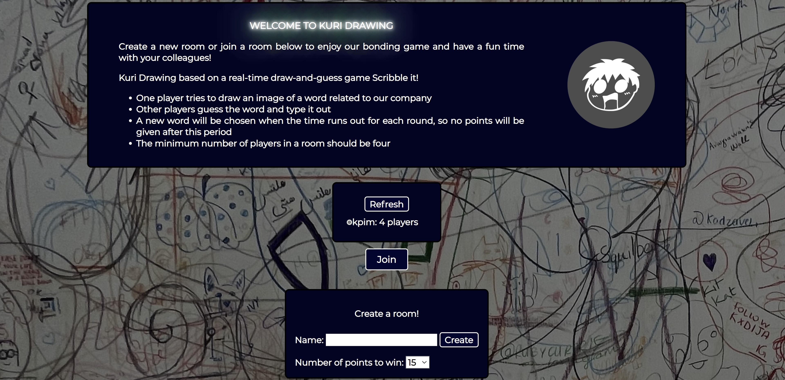

# KURI DRAWING

Kuri Drawing based on a real-time draw-and-guess game Scribble it!

+ A multiplayer game with socket.io, nodejs, Reactjs
+ Create a new room or join a room below to enjoy our bonding game and have a fun time with your colleagues!
+ One player tries to draw an image of a word related to our company
+ Other players guess the word and type it out
+ A new word will be chosen when the time runs out for each round, so no points will be given after this period
+ The minimum number of players in a room should be 4

## Requirements

For development, you will only need Node.js installed in your environement.

### Node

- #### Node installation on Windows

  Just go on [official Node.js website](https://nodejs.org/) and download the installer. Also, be sure to have `git`
  available in your PATH, `npm` might need it (You can find git [here](https://git-scm.com/)).

- #### Node installation on Ubuntu

  You can install nodejs and npm easily with apt install, just run the following commands.

      $ sudo apt install nodejs
      $ sudo apt install npm

- #### Other Operating Systems
  You can find more information about the installation on the [official Node.js website](https://nodejs.org/) and
  the [official NPM website](https://npmjs.org/).

If the installation was successful, you should be able to run the following command.

    $ node --version
    v16.13.1

    $ npm --version
    8.3.0

If you need to update `npm`, you can make it using `npm`! Cool right? After running the following command, just open
again the command line and be happy.

    $ npm install npm -g

---

## Install

    $ git clone https://github.com/hlinh88/kuri-drawing.git
    $ cd PROJECT_TITLE
    $ npm install 

## Running the project

    $ npm run start
